# Notion Ticket → Direction Factory

Take one Notion ticket and run it through the full divergence→convergence pipeline.
You (the agent) do the mechanical work and the self-correcting loops; the human
stands at the gates where taste, strategy, and politics actually live. Gate 1 (the
direction decision) is automated by a real evaluator and reverts to the human only
when confidence is low — the other three gates (0, 2, 3) stay human.

**Core principle:** automate the *convergence* loops (does this match the spec /
the design system / the pixels?), gate the *divergence* decisions (which idea, is
this the right bet, will leadership buy it?). Never gate what an evaluator can
judge; always gate what only the human can.

**Ownership flips at Gate 1:** before Gate 1 the **coded prototype is the source of
truth** (fast, disposable). The moment a direction survives the funnel, **Figma
becomes canonical** and the prototype is regenerated *from* Figma — never the
reverse. This keeps the sync one-directional and closeable.

## Configure before first run

Fill these in (or confirm) at the top of each run — don't assume:

- **Notion**: ticket source DB + the status/decision-log fields. Ticket link is the entry point.
- **Design system**: the component library name, the **version-bar** component id, and where the **design guidelines** live.
- **Figma**: target file + the page naming convention for converted directions.
- **Prototype**: Vercel project for preview deploys (branch-per-ticket).
- **Mode**: `avoid-editing` (default — human leaves comments/verbs, agent makes every change) or `edit-and-feed-back` (human edits Figma directly, agent syncs prototype to match). Pick per ticket.

## The two filters that govern everything

1. **Distinctness gate (per direction).** Every generated direction must differ on a
   *structural* axis — mental model, navigation, density, or core interaction — not
   just styling. Two restyles of the same idea = one direction. Regenerate the
   weaker twin with an explicit "must differ on X" constraint.

2. **Insight ≠ information gate (research).** Every research finding must end in
   "…therefore, for our direction: ___." A fact with no design implication is
   information — drop it. Only implications survive into the "?" popover.

## Workflow

Run in order. Each AI phase carries a loop with a hard exit condition; each gate
stops and waits for the human.

### Phase 0 — Ingest the ticket  · then **GATE 0**

Read the ticket and everything it links: requirements, the discussion thread, who
decided what, owners, and each person's beta/stance. Produce a **structured brief**:
problem, constraints, decisions-already-made, open questions, success signal.
Stop and have the human confirm the brief is accurate before spending any cycles.
Catch hallucinated context here, where it's cheap.

### Phase 1 — Research for insights (comes first)

Before generating anything, research the problem space on two parallel tracks.
Both converge through the **insight≠information gate** — every reference, conceptual
or visual, must end in "…therefore, for our direction: ___." Output, per emerging
angle: references → insight → pro/con. This is the raw material directions are
*built from*, not decorated with afterwards.

**Track A — Conceptual.** Similar use cases on the web, how comparable products
solve and *position* this, what patterns convert.

**Track B — Visual inspiration loop.** Mine real UI/layout references for structural
ideas. Mechanism: `WebSearch` scoped to design galleries (`site:dribbble.com`,
`site:behance.net`, Pinterest boards, Google Images result pages) → `WebFetch` the
shot/board pages → `get_screenshot` where you need to actually see the layout.
- **Extract structure, not skin.** Pull mental model, navigation, density, and core
  interaction patterns — *never* colors, fonts, shadows, or spacing. DataOrb forbids
  new tokens (CLAUDE.md), and the distinctness gate is defined on structural axes, so
  structural inspiration feeds directions directly while styling inspiration is noise.
- **Relevance + on-brand filter.** Score each reference for relevance to the ticket's
  problem; de-dupe against DataOrb's own design language before it earns a slot.
- **Loop exit:** ≥1 distinct structural pattern per emerging angle AND new references
  stop yielding new patterns (saturation / diminishing returns) — not a fixed count.

### Phase 2 — Generate N distinct directions (from the insights)

Generate `n` directions (n = 1…∞ — as many as are genuinely distinct; do not pad to
hit a number). Each is a **live coded prototype** on a branch, deployed to Vercel.
Each inherits its pros/cons and reference→insight chain from Phase 1.
- **Loop exit:** all directions pass the distinctness gate (pairwise-similarity check).
- Render them in the **version-bar** component so the human can switch between live versions.
- Each version carries a **"?"** affordance → popover. Top layer: scannable pros/cons.
  "More detail" tab: the references pulled and the insights derived (the reasoning chain).

### Phase 3 — **AUTO-GATE 1** · direction decision (the big one)

This is the one divergence decision the skill automates — but never blindly. The
move is **score → confidence-check → branch**: build a real evaluator, auto-select
only when it's confident, and fall back to the human exactly when it isn't. This
honors "never gate what an evaluator can judge; always gate what only the human can"
rather than breaking it.

1. **Score every direction.** Run the `design-evaluator` agent against a weighted
   rubric: spec-fit · distinctness · insight-grounding · design-system fit ·
   feasibility · predicted-strategy-fit. Rank the directions.
2. **Confidence check decides who drives:**
   - Top score clears an **absolute threshold** AND beats the runner-up by a
     **margin** AND trips no hard-negative constraint → **auto-select and proceed.**
   - Close call / low confidence → **fall back to HUMAN GATE 1** (manual review below).
3. **Auto-select is recoverable.** Decide *before* the Figma ownership-flip, while the
   prototype is still cheap. Post the pick + full scorecard + reasoning to Notion and
   open a **time-boxed veto window** — proceed by default; a human veto/redirect routes
   back to the human gate.
4. **Escape hatch.** No direction clears the threshold → regenerate Phase 2 with the
   failure as a hard-negative constraint, **bounded to N retries**, then escalate to
   the human. Bounded so it can never spin forever.

> **Honest caveat:** *predicted-strategy-fit* is the one axis an evaluator can't truly
> judge — that's exactly what the threshold, margin, and veto window protect.

**Human Gate 1 (fallback).** When confidence is low, vetoed, or retries are exhausted,
the human reviews directions in the version bar using a fixed verb schema you parse
deterministically — **always echo your parsed reading back for a one-line confirm
before acting:**

- Per direction: `keep` · `discard` · `refine <scoped note>` · `merge <a+b>` · `branch <into variants>`
- Global: `funnel <keep these, drop rest>` · `reject-all <reason>`

`refine` feedback is either **crisp** (anchored to a version + element — drops into a
scoped refine loop) or **wide** (directional, applies across all survivors as a
constraint). `reject-all` is the escape hatch: the reason becomes a hard negative
constraint and you regenerate Phase 2 — never repeat the same miss.

### Phase 4 — Build the base Figma (chosen directions)

Convert each surviving direction into Figma pages. **Figma is now canonical.**
- **Reuse first:** search the design system and instantiate existing components
  (`figma_search_components`, `figma_instantiate_component`). Build a new component
  only when nothing fits — and standardize it to the library.
- **Loop exit (runs unattended):** design-system audit clean (`figma_audit_design_system`,
  `figma_lint_design`) — no hardcoded values, tokens used, component-reuse high; AND
  every interactive element has all states defined (hover/active/disabled/loading/empty/error).

### Phase 5 — **GATE 2** · stakeholder review

Human gathers PM / CEO feedback in Figma. The only gate the human doesn't fully
control — that's the point; it's where politics lives. On "request changes":
- `avoid-editing` mode → stakeholders/human comment; agent makes the edits.
- `edit-and-feed-back` mode → human edits Figma directly; proceed to Phase 6 to sync.

### Phase 6 — Figma → code sync (pixel-perfect)

One direction only: extract tokens/CSS/layout from Figma via MCP
(`get_design_context`, `get_variable_defs`, `download_assets`, `get_code_connect_map`),
patch the prototype to match, render, visual-diff.
- **Loop exit:** visual diff ≈ 0.
- Embed the prototype **play-link inside Figma** so the version plays from a button.

### Phase 7 — Completeness + standardization · then **GATE 3**

Final unattended pass: design guidelines satisfied; all micro-interactions carried
over and finalized; consistent with the other files in Figma (so it doesn't look
like it came from a different studio). Then the human signs off → **developer handoff**:
detailed Figma + embedded playable prototype + token/spec parity.

### Phase 8 — Write status back to Notion

Update the ticket: chosen direction(s), the feedback log (verbs + decisions),
Figma + prototype links, and final status. Notion stays the system of record.

## The loops, and what stops each (quick reference)

- **Visual mining** (Phase 1, Track B) — stop at structural-pattern saturation.
- **Insight ≠ info** (Phase 1) — drop any finding without a design implication.
- **Distinctness** (Phase 2) — stop when all directions are structurally orthogonal.
- **Direction scoring** (Phase 3) — auto-select on confidence; else fall back to human.
- **DS-compliance + completeness** (Phase 4) — stop when audit clean + all states defined.
- **Pixel-match** (Phase 6) — stop when visual diff ≈ 0.
- **Standardization** (Phase 7) — stop when consistent with sibling Figma files.

Only the insight and distinctness loops ever surface to the human (at Gate 1, and
only when Auto-Gate 1 hands off). The rest run silent and report pass/fail.

## Principles

- **Research feeds generation; never decorate after.** Directions are built from
  insights, not retro-fitted with them.
- **Distinct on structure, not skin.** If two directions could be a theme toggle,
  they're one direction.
- **Echo feedback before acting.** One-line parsed-readback prevents a wasted cycle
  from a misread verb.
- **One source of truth per phase.** Code leads divergence, Figma leads convergence.
  Sync is one-directional. No bidirectional drift.
- **Reuse beats invent.** Borrow components from the library; build new only when
  forced, and standardize it immediately.
- **Gates are few and load-bearing.** Gate 1 is automated by a real evaluator and
  reverts to the human only on low confidence; the other three (0, 2, 3) stay human.
  Everything else is a loop with an exit condition.

## Flow diagram

```mermaid
flowchart TD
    A[Phase 0: Ingest ticket] --> G0{GATE 0\nbrief accurate?}
    G0 -->|human confirm| P1

    subgraph P1 [Phase 1: Research for insights]
        direction TB
        C[Track A: Conceptual\nhow products solve & position]
        subgraph VIS [Track B: Visual inspiration loop NEW]
            direction TB
            V1[WebSearch scoped:\nDribbble / Pinterest / Behance / Google Images]
            V2[WebFetch + get_screenshot\nsee real layouts]
            V3[Extract STRUCTURE not skin\nmental model / density / nav]
            V4[Relevance + on-brand filter\nde-dupe vs DataOrb language]
            V1 --> V2 --> V3 --> V4
            V4 -->|patterns still emerging| V1
        end
        C --> IG
        V4 --> IG{Insight =/= info gate\nends in 'therefore: ___' ?}
    end
    IG -->|saturated:\n>=1 structural pattern per angle| P2

    P2[Phase 2: Generate N distinct directions\nlive coded prototypes + version bar] --> DG{Distinctness gate}
    DG -->|not orthogonal| P2

    DG -->|all orthogonal| SC[Score each direction\ndesign-evaluator agent + weighted rubric]

    subgraph AG1 [Auto-Gate 1 NEW: automate direction decision]
        direction TB
        SC --> CONF{Confidence check\ntop >= threshold AND\nmargin over runner-up AND\nno hard-negative hits?}
        CONF -->|no direction passes| RG{Retries left?}
        RG -->|yes| P2
        RG -->|no| HG[Fall back to HUMAN GATE 1]
        CONF -->|close call / low conf| HG
        CONF -->|clear winner| AUTO[Auto-select top direction\npost scorecard + reasoning to Notion]
        AUTO --> VETO{Time-boxed veto window\nhuman interrupts?}
        VETO -->|veto / redirect| HG
    end

    HG -->|funnel / keep| P4
    VETO -->|no veto, proceed| P4

    P4[Phase 4: Build base Figma\nFigma now canonical] --> L4{DS audit + all states defined?}
    L4 -->|fail| P4
    L4 -->|clean| G2{GATE 2\nstakeholder review}
    G2 --> P6[Phase 6: Figma -> code sync]
    P6 --> L6{Visual diff ~ 0?}
    L6 -->|no| P6
    L6 -->|yes| P7[Phase 7: Completeness + standardization]
    P7 --> G3{GATE 3\nfinal sign-off + handoff}
    G3 --> P8[Phase 8: Write status back to Notion]

    style VIS fill:#e8f0fe,stroke:#4285f4
    style AG1 fill:#fce8e6,stroke:#ea4335
```

